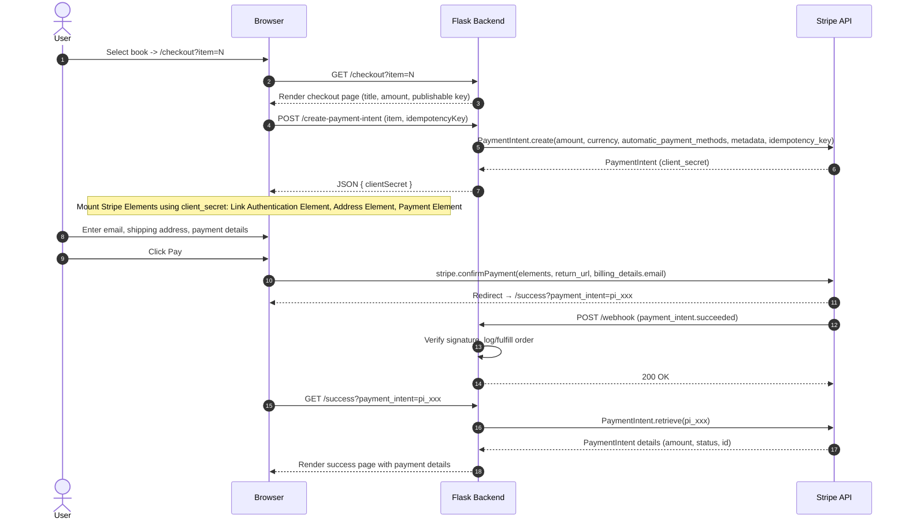

# Sample Stripe Payment Intents API Integration

## Overview  
This example application builds upon the provided [sample python application](https://github.com/marko-stripe/sa-takehome-project-python) by collecting and processing payment information using three complementary Stripe Elements (Payment Element, Link Authentication Element, Address Element) with the Payment Intents API. 

## Quickstart

To run the application locally:

**Step 1: Clone the repo**
```sh
git clone https://github.com/IcrequeI/creque-stripe-paymentintents-api.git
cd creque-stripe-paymentintents-api
```

**Step 2: Install dependencies**
```sh
pip install -r requirements.txt
```

**Step 3: Configure your environment variables**
```sh
cp sample.env .env
```
Open `.env` and provide your test-mode API keys from the [Stripe Dashboard](https://dashboard.stripe.com/test/apikeys):

```
STRIPE_SECRET_KEY=sk_test_...
STRIPE_PUBLISHABLE_KEY=pk_test_...
STRIPE_WEBHOOK_SECRET=whsec_...
```

**Step 4: Run Flask**
```sh
flask run --port 5000
```

**Step 5: Set up webhooks with Stripe CLI**
```sh
stripe login
stripe listen --forward-to localhost:5000/webhook
```

**Step 6: Open the application in your browser**

Navigate to [http://localhost:5000/](http://localhost:5000/) to access the checkout site and test the integration.

You can use the following valid Stripe test card details to simulate a successful transaction.

| Field            | Value            | Notes                      |
|------------------|------------------|----------------------------|
| **Card number**  | 4242 4242 4242 4242 | Visa (test card)           |
| **Expiration**   | Any future date   | e.g., 12/34                |
| **CVC**          | Any 3 digits      | e.g., 123                  |
| **ZIP/Postal**   | Any 5 digits      | e.g., 12345                |

For more test values, see the [Stripe Testing Docs](https://stripe.com/docs/testing).


## Architecture  
The solution implemented follows a client-server architecture: The Payment Intent API is used to securely create a PaymentIntent based upon the item selected by the user. We then mount Stripe Elements to collect payment (Payment Element), shipping (Address Element), and contact details (Link Authentication Element). Once the user has entered their data and clicked the Pay button, we submit the payment for processing. Once the payment is completed (or fails), Stripe sends the result to the configured webhook to render the result to the user.



The solution is designed to take advantage of the Payment Intents API, which offers a number of key benefits. By using Payment Intents and Stripe Elements, the application can securely and flexibly handle the entire lifecycle of a payment maintaining a consistent brand experience without redirecting the user off-site. The messaging and event-driven design enhances the user experience while ensuring developers can implement customized error handling, collect from custom data fields, trigger other downstream events, and fulfill orders based on definitive webhook events. 

You can read more about the benefits of the Payment Intents API vs. the Checkout Session API [here](https://docs.stripe.com/payments/checkout-sessions-and-payment-intents-comparison).

## My Approach & Challenges Uncovered
After reviewing and familiarizing myself with the repo, I thought through previous experience both in interacting with payment solutions (like Stripe) as well as prior experience in implementing Stripe Checkout (even though this project specifically required the use of Payment Elements). This helped me think through a basic set of "requirements" for my application:

- Present a checkout page displaying accurate product information
- Collect payment information
- Submit payment 
- Collect required user information (email and address, at minimum)
- Display result of transacation (success or failiure)

I also took into account **additional considerations**: preventing duplicate charges, protecting API keys and other secrets, accurately displaying item details including pricing, basic security to prevent malicious actors from submitting invalid transactions, handling basic error conditions

This helped inform a high-level design that, assisted by Stripe's documentation, allowed me to formulate an implementation approach. I primarily followed the [Payment Intents API Quickstart Guide](https://docs.stripe.com/payments/quickstart?lang=python) and the [Payment Element integration best practices](https://docs.stripe.com/payments/payment-element/best-practices) using the reference code snippets in most all cases.

There were a few **challenges** that required decisions meaningfully influencing the implementation:
- **Email collection:** The initial sample application included an email collection field. In order to still collect this data, I included the Link Authentication Element to capture the email field with the added bonus of being able to offer the user to register with Link for even easier payments in the future. 
- **Address collection:** Address collection is not part of the Payment Element and requires a separate element. Though we could have satisfied the basic requirements of the project without it, I added the Address Element to collect the user's address as it would be required for order fulfillment; and also opens up the possibility to include automated tax collection in the future.
- **Webhooks:** As webhooks provide the definitive result of the transaction, it was important to test this as well. I had recalled there was a "trick" to configuring this locally so I could test end-to-end. I found the step and syntax to do so via the Stripe CLI and this up for testing. 
- **Price validation:** One of the items I identified as an important consideration during design, was to think through ways to protect from malicious actors manipulating PaymentIntents (e.g. creating a PaymentIntent with one book but overriding the price). I decided to move the source of truth for items (including title, price, description) into a BOOKS dictionary on the server-side as a result. This way, we're not relying on the client to send the item details, just the item ID. 

Once implemented, I tested the solution end-to-end with data from the [Stripe Testing documentation](https://docs.stripe.com/testing) exercising both successful payment scenarios and failure conditions.

## Future Enhancements
This sample application focuses on a simple end-to-end integration using the Stripe Payment Element for payment processing while collecting user details required for fullfillment. Of course, Stripe provides additional elements and APIs that can be used to extend the functionality of this application to meet more robust requirements. The following are potential future enhancements for consideration:  

- Automate tax collection
- Automate shipping charges
- Add to cart
- Send an email receipt
- Handle requests for refunds
- Inclusion of additional metadata for reporting
- Improved UI handling during loading of elements
- Improved error handling and messaging

## Reference Documentation
### API Guides:
- [Payment Intents API Quickstart Guide](https://docs.stripe.com/payments/quickstart?lang=python)
- [Payment Element integration best practices](https://docs.stripe.com/payments/payment-element/best-practices)

### Elements:
- [Payment Element](https://docs.stripe.com/payments/payment-element)
- [Address Element](https://docs.stripe.com/elements/address-element)
- [Link Authentication Element](https://docs.stripe.com/payments/elements/link-authentication-element)
- [Tax ID Element](https://docs.stripe.com/elements/tax-id-element) (FUTURE)

### Other References:
- [Test Data](https://docs.stripe.com/testing)
- [Stripe Webhooks](https://docs.stripe.com/webhooks)
- [Stripe Python LIbrary](https://github.com/stripe/stripe-python)